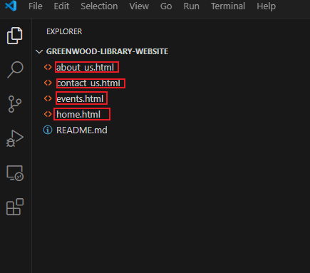
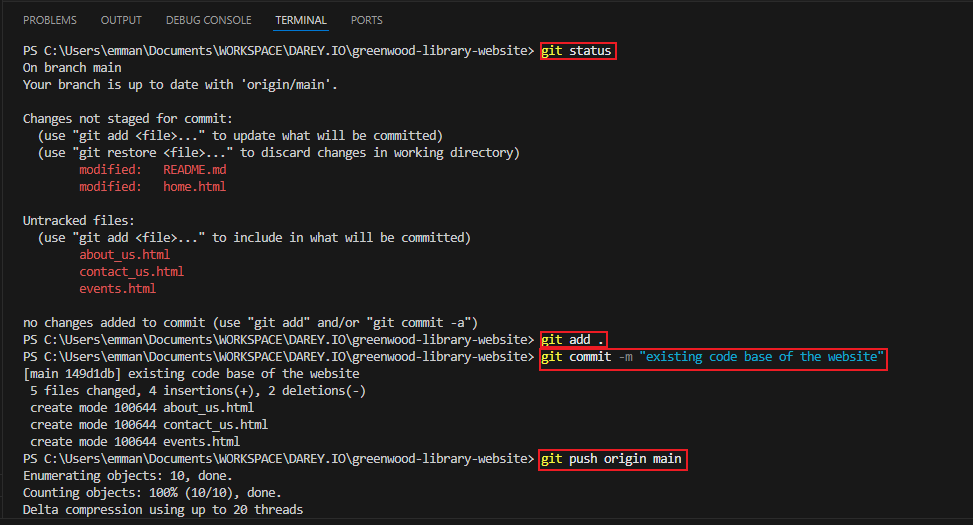
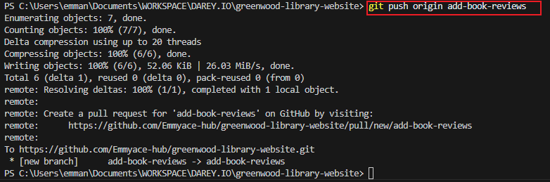
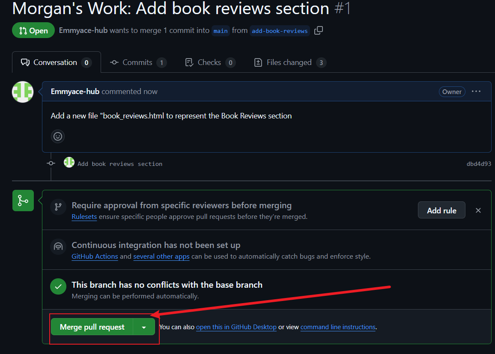

# Project : Enhace the Greenwood Community LIbrary Website

## Summary

## **Set up**

* I Created a repository on Github and  named it greenwood-library-website :

* I initialised it with a README.md file and cloned it into my local 
repository :

* In the main main branch, i used Visual Studio Code editor to ennsure the web pages files were available:

* i staged,committed and pushed the changes directly to the main branch:

* Morgan added a new file book_reviews.html to represent the Book Reviews Section afterwhich i staged , commit and push the changes i made into my Github repository:

* Morgan raised a pull request which was reviewed and confirmed  :

* Morgan's work was merged into the main branch

* Jamie pulled the latest changes from the main branch of the repository to make updates on the event section:

* after jamie made the necessary changes he created a pull request which was confirmed and merged into the main branch:

